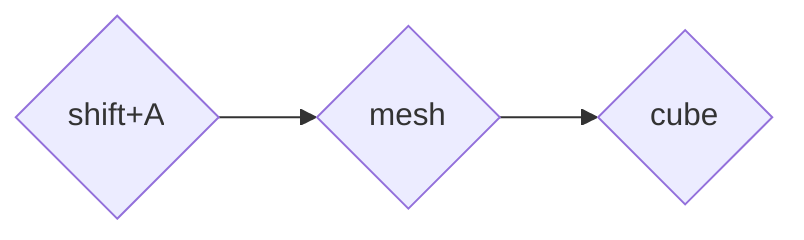

# Движение и вращение куба
- [Движение и вращение куба](#движение-и-вращение-куба)
        - [Алгоритм](#алгоритм)
        - [Импорт библиотеки(api blender)](#импорт-библиотекиapi-blender)
        - [Добавление куба на сцену](#добавление-куба-на-сцену)
        - [Создание \<\<указателя на куб\>\>](#создание-указателя-на-куб)
        - [Добавляем ключевой кадр(keyframe)](#добавляем-ключевой-кадрkeyframe)
        - [Изменение положения куба](#изменение-положения-куба)

##### Алгоритм

- Добавляем куб на сцену
- Получаем ссылку на добавленный объект
- Добавляем ключевой кадр на первый кадр анимации
- Изменяем положение куба
- Добавляем ключевой кадр на последний кадр анимации

##### Импорт библиотеки(api blender)

Для начала импортируем библиотеку `bpy`:

```py
import bpy
```

##### Добавление куба на сцену

Узнаем как добавить куб, используя библиотеку `bpy`. Для этого <<ручками>> добавим куб на сцену:



В консоли увидим нужный метод:

```python
bpy.ops.mesh.primitive_cube_add()
```

##### Создание <<указателя на куб>>

<<Указатель на активный объект>>(в нашем случае добавленный куб) содержится в поле:
```python
bpy.context.active_object
```

<<Адрес>> может быть сохранен в какую-либо переменную для дальнейшего взаимодействия с объектом.

##### Добавляем ключевой кадр(keyframe)

Keyframe добавляется методом `keyframe_insert` объекта blender. При этом стоит указывать какой анимации соответсвует данный ключевой кадр.

Так как мы хотим изменять положение объекта - передаем строку `"location"`. 

Положение ключевого кадра задаётся аргументом `frame`. 

Итоговая команда выглядит так:

```python
cube.keyframe_insert("location",frame = startFrame)
```
> Для вращения куба следует передавать строку "rotation"

##### Изменение положения куба 

Положение куба задаётся кортежем, хранящемся в поле `.location` объекта куба. Поэтому для изменения положения пишем:

```python
cube.location = (newX,newY,newZ)
```

##### Вращение куба(с использованием углов Эйлера)

Вращать объект так же легко, как и перемещать:

```python
cube.rotation_euler = rotationEulerAngles
```
> rotationEulerAngles - кортеж, содержащий углы Эйлера, задающие положение тела


##### Результат

Код для вращения и изменения положения куба:
```python
import bpy
import math

bpy.ops.mesh.primitive_cube_add()

cube = bpy.context.active_object

startFrame = 1
endFrame = 180
midFrame = (endFrame - startFrame)//2
rotationEulerAnglesMid = (math.radians(70),0,math.radians(90))
rotationEulerAnglesStart = (0,0,0)

cube.rotation_euler = rotationEulerAnglesStart
cube.location = (-1,-1,-1)
cube.keyframe_insert("location",frame = startFrame)
cube.keyframe_insert("rotation_euler",frame = startFrame)

cube.rotation_euler = rotationEulerAnglesMid
cube.location = (1,1,1)
cube.keyframe_insert("location",frame = midFrame)
cube.keyframe_insert("rotation_euler",frame = midFrame)

cube.location = (-1,-1,-1)
cube.rotation_euler = rotationEulerAnglesStart
cube.keyframe_insert("rotation_euler",frame = endFrame)
cube.keyframe_insert("location",frame = endFrame)
```